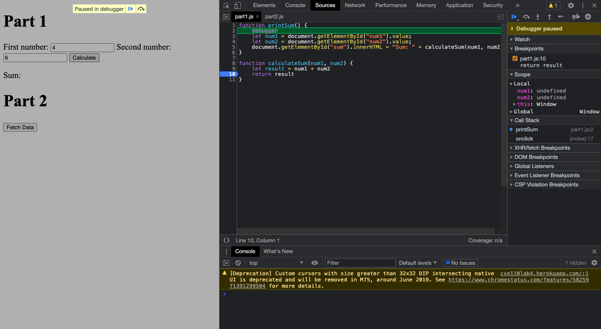
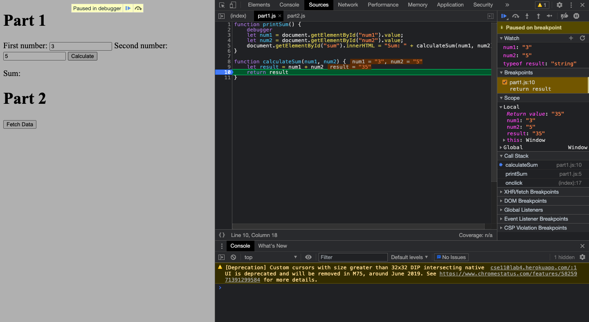
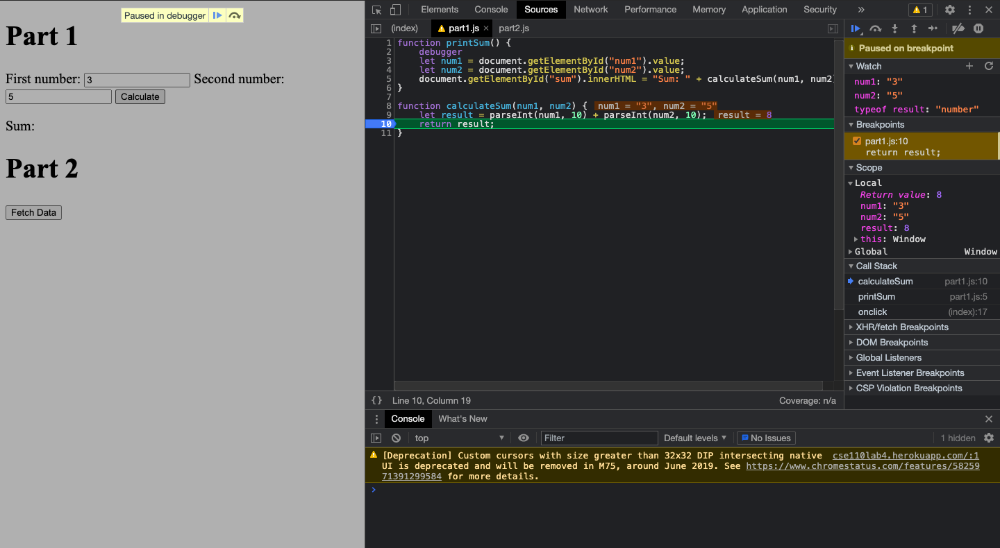

# Part 3
## Debugging screenshots
Breakpoint

Watch list

1. What was the bug? Instead of adding two number values, the website put to values next to each other & treated it as string concatonation.
2. How would you fix it? parse the string value to number value.

3. citylots.json
4. part2.js
5. 11.7MB
6. 165 ms
7. Mozilla/5.0 (Macintosh; Intel Mac OS X 10_14_6) AppleWebKit/537.36 (KHTML, like Gecko) Chrome/90.0.4430.85 Safari/537.36
8. Apache
9. Tue, 26 Jan 2021 22:14:13 GMT
10. application/json
11. fetchData, onClick